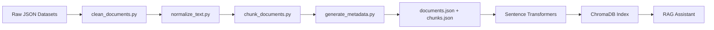
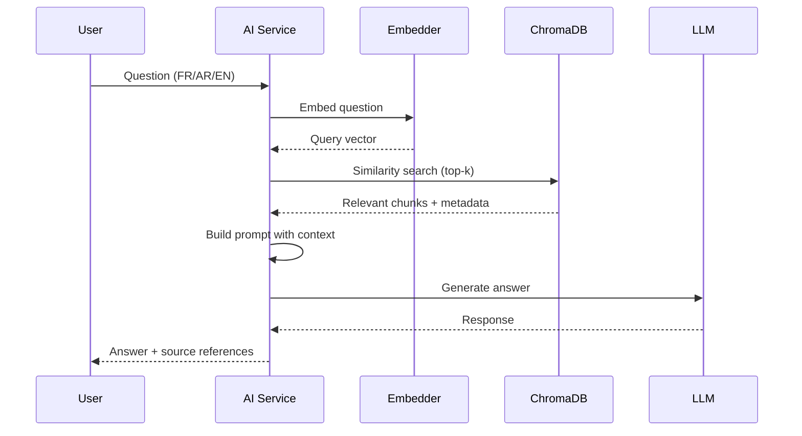

# AI Pipeline

## CRISP-DM Lifecycle

```text
1. Business Understanding    → notebooks/01_business_understanding.ipynb
2. Data Understanding      → notebooks/02_data_understanding.ipynb
3. Data Preparation        → preprocessing/ (completed)
4. Modeling                → embeddings/build_index.py
5. Evaluation              → evaluation/evaluate_retrieval.py
6. Deployment              → deployment/ + ai-service integration
```

## Knowledge Base Pipeline



## Dataset Categories

| Category | Source Files | Records |
| --- | --- | --- |
| Corporate | corporate_information.json | Identity, vision, values |
| Products | products_overview, customer_segments | Product catalog, segments |
| Digital Banking | accounts, transfers, cards, services | @mennet, Amen Mobile |
| Security | security.json | Authentication, fraud |
| Agencies | agencies.json | Branch locations |
| FAQ | faq.json | Common questions |
| Financing | credit_services.json | Loans, credits |
| Investment | investment_exchange.json | SICAV, exchange |

## Embedding Models

| Model | Dimensions | Languages |
| --- | --- | --- |
| paraphrase-multilingual-mpnet-base-v2 | 768 | FR, AR, EN |
| intfloat/multilingual-e5-large | 1024 | FR, AR, EN |

Default: `paraphrase-multilingual-mpnet-base-v2` (lighter, good multilingual performance).

## RAG Pipeline



## Chunking Strategy

- **Size**: ~500 tokens per chunk
- **Overlap**: 100 tokens
- **Splitting**: Sentence-aware boundaries
- **Metadata**: category, language, source, document_id, chunk_index

## Evaluation Metrics

| Metric | Description |
| --- | --- |
| Precision@K | Relevant docs in top-K results |
| Recall@K | Fraction of relevant docs retrieved |
| MRR | Mean Reciprocal Rank |
| Latency | End-to-end response time |
| Relevance | LLM-judged answer quality |
| Hallucination Rate | Answers not grounded in context |

Run evaluation:

```bash
cd ai-engine/evaluation
pip install -r requirements.txt
python evaluate_retrieval.py
```

## LLM Provider Abstraction

The AI service supports pluggable LLM backends:

| Provider | Use Case |
| --- | --- |
| `mock` | Development / testing (template responses) |
| `openai` | Production with GPT-4o-mini |
| `ollama` | Local inference with Llama 3 |

Configure via `LLM_PROVIDER` environment variable.

## Privacy Guards

The preprocessing pipeline rejects records containing:

- IBAN-like patterns
- Credit card numbers
- Balance dumps
- Login credentials
- Customer-specific data

## Multilingual Support

- Dataset records tagged with `language` (fr, ar, en)
- Multilingual embedding model handles cross-lingual retrieval
- LLM prompts include language instruction for response generation
