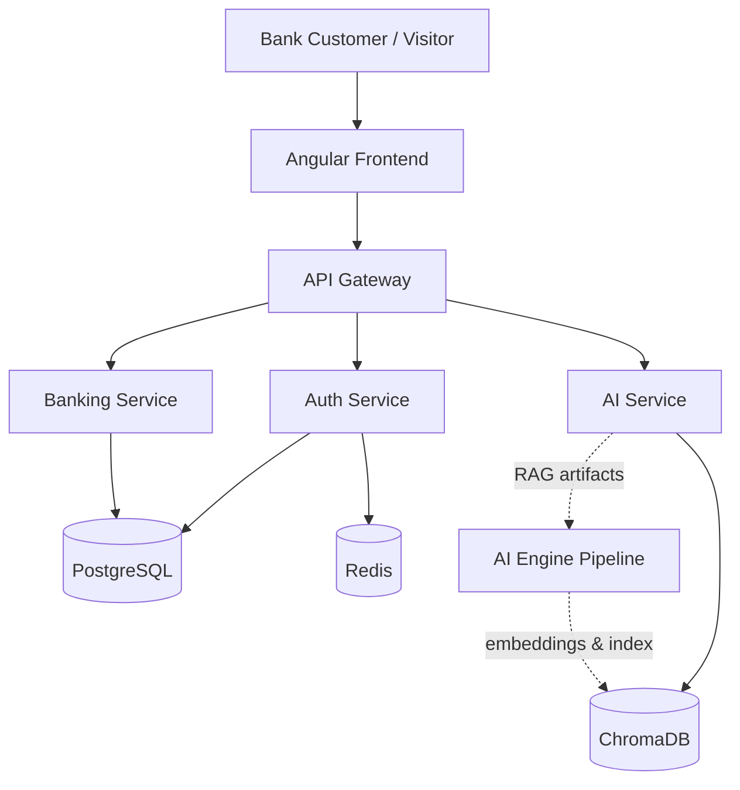
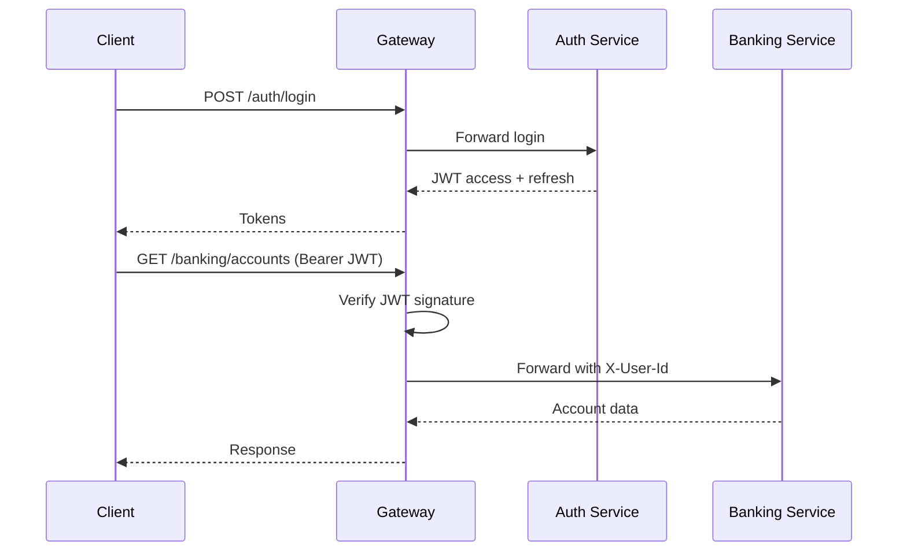

# Amen Bank Platform — Architecture

## Overview

The Amen Bank Intelligent Digital Banking Platform follows **Clean Architecture** with **Domain-Driven Design** boundaries across three independent deployable units.

## System Context



## Microservices

### API Gateway (`:8000`)

Single entry point. Responsibilities:

- Route requests to downstream services
- Verify JWT on protected routes
- Rate limiting (Redis-backed)
- Structured request logging

### Auth Service (`:8001`)

Identity and access management:

- Registration / login
- JWT access + refresh tokens
- Role-based access (customer, admin)
- bcrypt password hashing

### Banking Service (`:8002`)

Core banking domain:

- Accounts & balances
- Transactions
- Transfers & beneficiaries
- Products (accounts, cards, loans)
- Agencies
- Support messages

### AI Service (`:8003`)

Inference layer consuming AI Engine artifacts:

- `POST /chat` — RAG conversational assistant
- `POST /search` — semantic search
- `POST /recommend` — product recommendation
- `POST /document-question` — document Q&A

## AI Engine (Independent)

CRISP-DM lifecycle outside the backend:

```text
Business Understanding → Data Understanding → Data Preparation
        → Modeling (embeddings) → Evaluation → Deployment
```

Produces:

- `datasets/processed/chunks.json`
- `vector_database/` ChromaDB collection
- Evaluation metrics

## Security Architecture



## Data Stores

| Store | Purpose |
| --- | --- |
| PostgreSQL `auth` schema | Users, roles, refresh tokens |
| PostgreSQL `banking` schema | Accounts, transactions, transfers, messages |
| Redis | Rate limiting, session cache |
| ChromaDB | Vector embeddings + metadata for RAG |

## Deployment Topology

Docker Compose orchestrates 9 containers:

`frontend`, `nginx`, `gateway`, `auth-service`, `banking-service`, `ai-service`, `postgres`, `redis`, `chromadb`

## Design Principles

- **SOLID** — single-responsibility services, dependency injection
- **Clean Architecture** — api → services → repositories → database
- **DDD** — bounded contexts per microservice
- **12-Factor** — config via environment variables
